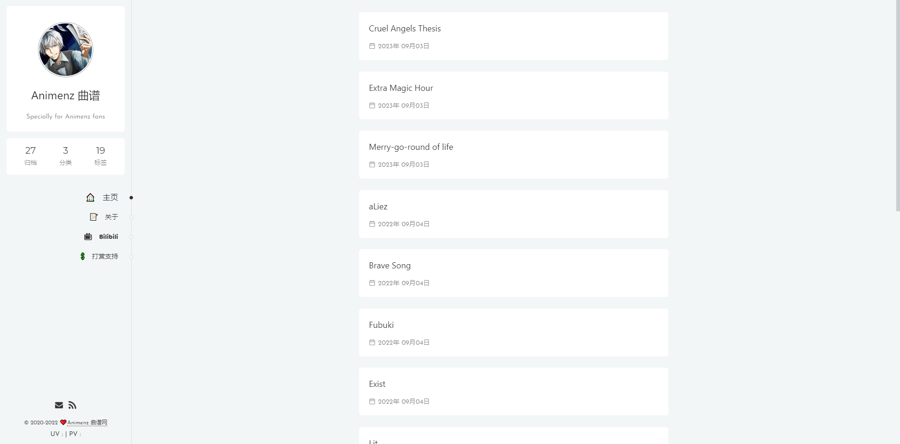

# Animenz Piano Sheets

#### Ссылка на код официального сайта: https://github.com/AnotiaWang/animenz



## Для установки:

### Клонировать репозиторий:
```
git clone https://github.com/vadushkin/animenz_piano.git
```

### Скачать все зависимости:
```
pip install -r requirements.txt
```

### Выполнить миграции:
```
python manage.py migrate
```

### Запустить сервер:
```
python manage.py runserver
```

## Для Docker'а:

### После клонирования репозитория нужно запустить команду:
```
docker-compose up -d
```

### Остановка Docker:
```
docker-compose stop
```