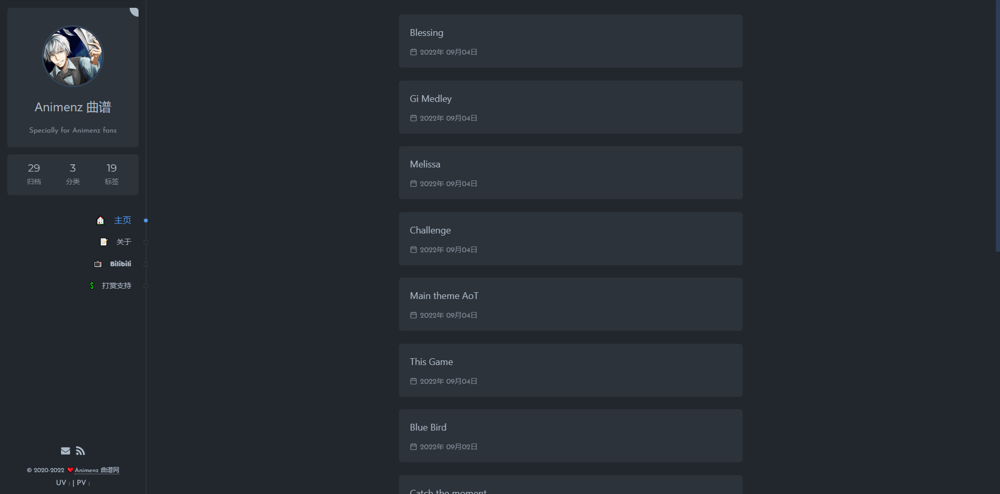
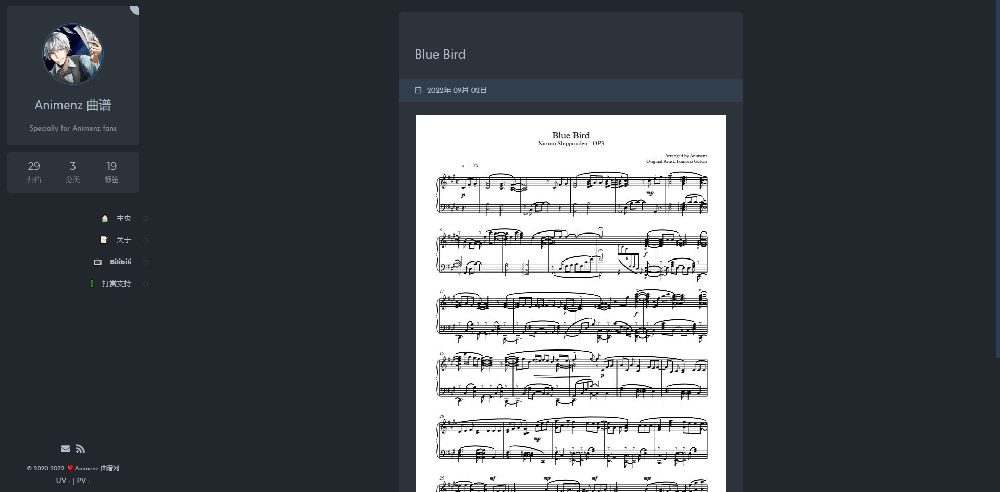

# Animenz Piano Sheets

#### Link to the code of the official website: https://github.com/AnotiaWang/animenz

Screenshots
---------





Installation
---------

```
git clone https://github.com/vadushkin/animenz_piano.git
cd animenz_piano
python -m venv venv
.\venv\Scripts\activate
pip install -r requirements.txt
python manage.py migrate
python manage.py runserver
```

### Admin Panel

```
python manage.py createsuperuser
```

Docker
------

```
git clone https://github.com/vadushkin/animenz_piano.git
cd animenz_piano
docker-compose up -d
```

### Stop Docker
```
docker-compose stop
```

Servic
------

* `/` - Main Page
* `admin/` - Admin Panel
* `about/` - About Animenz
* `donate/` - Donation
* `tags/` - Tags
* `tags/<slug>/` - Tag
* `post/<slug>/` - Post
* `archives/` - Archive of all posts
* `categories/` - Categories
* `categories/<slug>/` - Category

Api
---

* `api/v1/sheets/` - All posts
* `api/v1/sheets/<id>/` - Post
* `api/v1/sheets/tags/` - Tags
* `api/v1/sheets/categories/` - Categories
* `api/v1/drf-auth/` - Authentication
